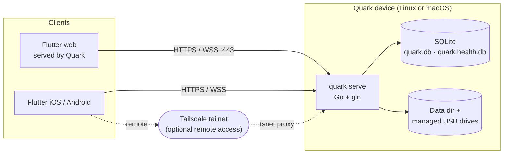

# Architecture

Quark is a self-hosted personal cloud. One Go binary runs on a device in the user's home, serves a REST and
WebSocket API, and embeds the Flutter web build; the same Flutter app also ships to iOS and Android. User files
live on disk — the internal data directory plus any USB drives Quark manages — and SQLite holds only what cannot
live on disk: accounts, sessions, albums, access grants, jobs, the search index, and the encrypted vault.

This page is the one-screen summary. The detail, with diagrams, lives in [`docs/architecture/`](docs/architecture/README.md).

## The two halves

| Half     | Where                                          | Shape                                                                                  |
| -------- | ---------------------------------------------- | -------------------------------------------------------------------------------------- |
| Backend  | `cmd/`, `internal/`, `pkg/`, `sql/`            | gin handlers → `pkg/util` services → `pkg/vfs` / `internal/db` (sqlc) → disk + SQLite |
| Frontend | `lib/`, `packages/`                            | pages → controllers → services (HTTP / WebSocket); visuals from `quark_widgets`        |

## Load-bearing ideas

- **Handlers are thin.** A handler under `internal/server/api/v0/<segment>/` parses the request, calls a
  `pkg/util/*util` function with a `Params` struct, and maps the `Result` to a `*serverutil.Response`.
- **One dependency graph.** `deputil.Dependencies` carries the database, storage service, VFS registry, event
  bus, job queue, rate limiters, and vault session. No package-level mutable state.
- **Files stream, never buffer.** File content moves as `io.Reader` / `io.Writer`; a 4 GiB upload costs
  megabytes of heap.
- **Every mutation publishes an event.** The event bus fans out to `/api/v0/events` over WebSocket, filtered by
  what each user can read, so every open client refreshes.
- **Access is path-based.** `path_access` grants are additive down the tree; admins bypass them.
- **SQL goes through sqlc**; migrations are numbered and forward-only.
- **Reusable UI lives in `packages/quark_widgets`**: data in, callbacks out, no services, no routing.

## Read next

| Doc                                                              | Covers                                                      |
| ---------------------------------------------------------------- | ----------------------------------------------------------- |
| [System context](docs/architecture/system-context.md)            | deployment, clients, storage devices, remote access         |
| [Backend](docs/architecture/backend.md)                          | layers, startup, dependency graph, middleware, background work |
| [Request flows](docs/architecture/request-flows.md)              | auth, streaming upload, live events, background jobs        |
| [Data](docs/architecture/data.md)                                | SQLite databases, schema, VFS, the vault                     |
| [Frontend](docs/architecture/frontend.md)                        | Flutter app layers, routing, the widget package             |
| [Build and tooling](docs/architecture/tooling.md)                | code generation, checks, the `make understand` graph        |

Contributor rules — where a file goes, what a check enforces — are in [`AGENTS.md`](AGENTS.md).
