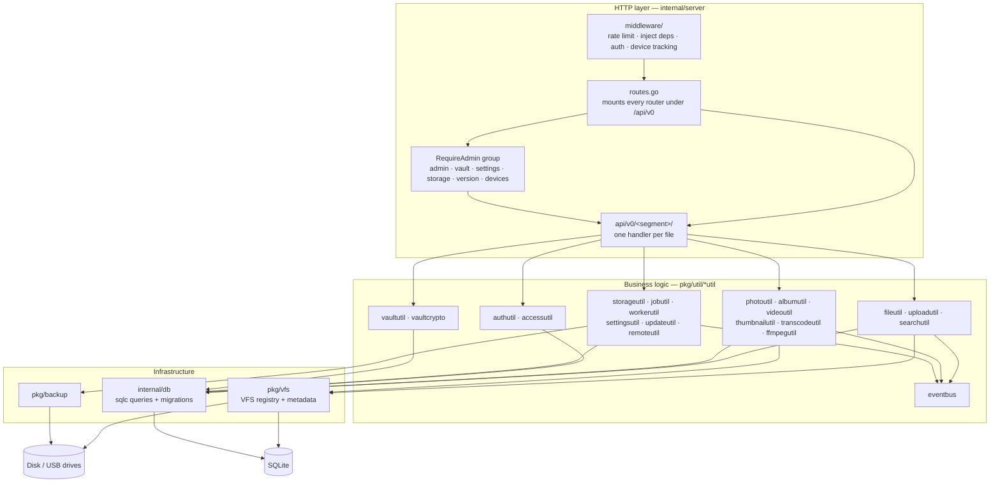
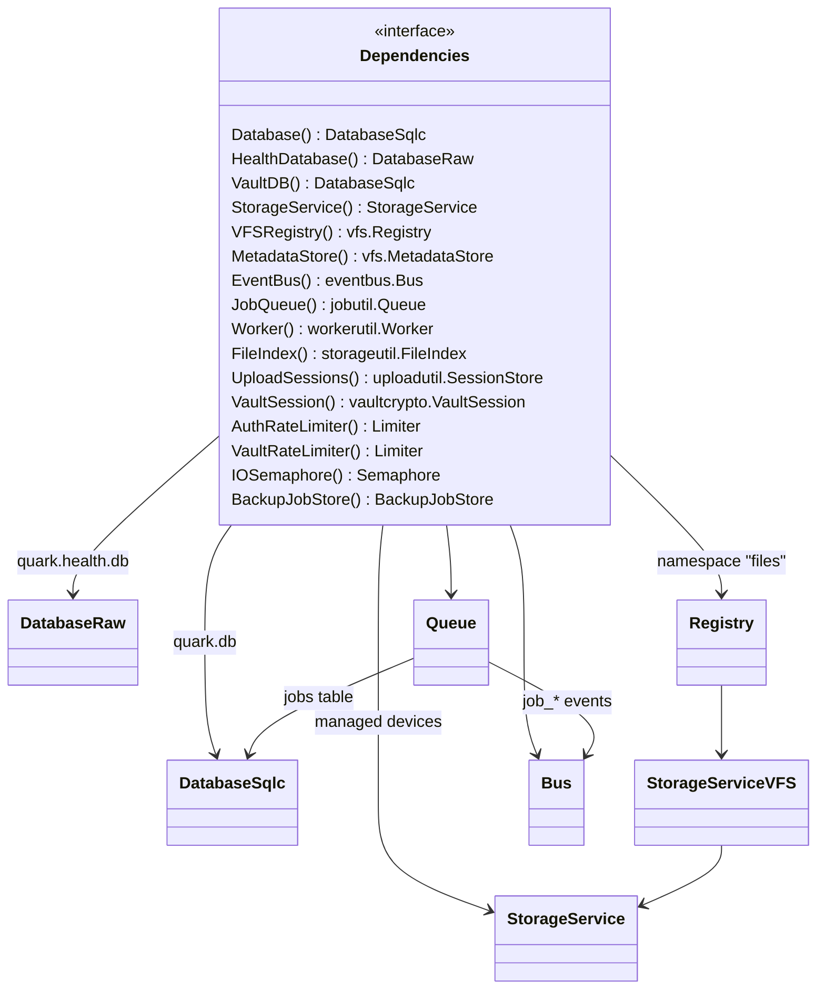
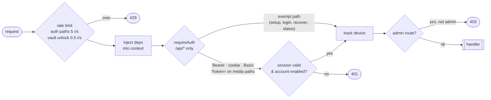
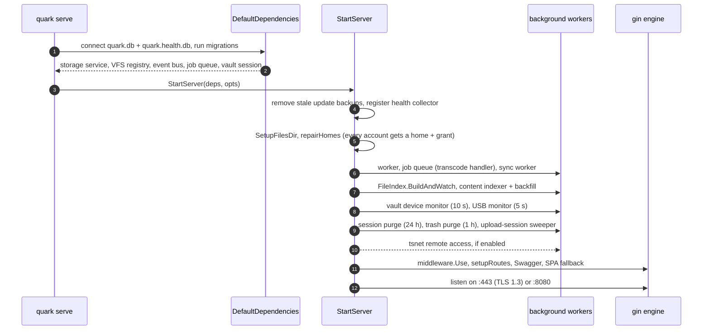

# Backend

The backend is one Go module (`github.com/autobutler-org/quark`) built on gin. Its layering is strict: a
handler never touches SQL or the filesystem directly, and business logic never sees a `*gin.Context`.

## Layers

The handler contract, from `AGENTS.md`:

1. Pull `deps` out of the request context: `ctxutil.Get[deputil.Dependencies](c, "deps")`.
2. Parse the request into a `pkg/util` `…Params` struct and call the service.
3. Return a `*serverutil.Response` (`Ok().WithData(…)`, `InternalServerError(err)`, …); return `nil` only when the
   handler streamed the response itself.

Directory names match URL segments (`/api/v0/albums/*` → `api/v0/albums/`), packages are named `v0_<segment>`,
and `scripts/check-go-structure.bash` enforces the file layout.

## Dependency graph

`deputil.Dependencies` is the single object every layer receives. `NewDependencies()` builds an empty graph with
the always-present pieces (rate limiters, upload session store, backup job store); `DefaultDependencies()`
connects the real ones. Tests start from the empty graph and chain `With…` builders to inject fakes.

## Middleware chain

`middleware.Use` runs before any route is registered, so every request passes through the same chain.

`?token=` is accepted only on paths where a header cannot be set (media streaming, downloads, the WebSocket).

## Startup

`server.StartServer` wires the background services before it opens the listener.

## Background work

| Worker                 | Package                         | Trigger              | Effect                                                    |
| ---------------------- | ------------------------------- | -------------------- | --------------------------------------------------------- |
| Job queue              | `jobutil` + `transcodeutil`     | enqueued job rows    | runs video transcodes per lane, publishes `job_*` events  |
| Worker                 | `workerutil`                    | backup requests      | copies files to a backup device off the request path      |
| Sync worker            | `pkg/backup`                    | file events          | keeps snapshots on a backup device in sync                |
| File index             | `storageutil.FileIndex`         | fs watch + events    | in-memory index of files across managed devices          |
| Content indexer        | `internal/server/content_indexer.go` | upload / move / delete | FTS5 rows for text documents; backfill at startup  |
| USB monitor            | `server.usbDeviceMonitor`       | every 5 s            | auto-mounts new drives                                    |
| Vault device monitor   | `server.vaultDeviceMonitor`     | every 10 s           | locks the vault when its drive disappears                 |
| Session purge          | `authutil`                      | startup + 24 h       | deletes expired sessions                                  |
| Trash purge            | `storageutil` + `accessutil`    | startup + 1 h        | deletes expired trash and its access rows                 |
| Upload sweeper         | `uploadutil.SessionStore`       | interval             | removes abandoned chunked uploads                         |

## Event bus

`pkg/util/eventbus` is an in-process pub/sub. Publishers never block: a subscriber that falls behind drops
events, so clients treat events as a hint to refresh and the REST endpoints as the source of truth.

| Kind group | Kinds                                                                                     |
| ---------- | ----------------------------------------------------------------------------------------- |
| Files      | `upload`, `delete`, `move`, `new_folder`, `trash_changed`                                   |
| Jobs       | `job_queued`, `job_started`, `job_progress`, `job_completed`, `job_failed`, `job_canceled` |
| Backup     | `backup_started`, `backup_progress`, `backup_completed`, `backup_failed`                   |
| Vault      | `vault_device_disconnected`, `vault_device_reconnected`, `vault_storage_changed`           |
| Accounts   | `account_changed`, `access_changed`                                                       |
