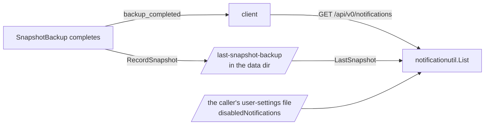

# Backup

`pkg/backup` copies a Quark onto a managed device that holds the `snapshot-backup` role. This page covers what a
snapshot holds, how the chat tables get into it and back out, and how an admin is reminded to take one. How the file copies survive a power cut is in
[Durability](durability.md).

## What a snapshot holds

`SnapshotBackup` writes everything under the target device's files directory:

| Entry                             | What it is                                                                | Written by       |
| --------------------------------- | ------------------------------------------------------------------------- | ---------------- |
| `<device>_<serial>/`, `internal/` | every other managed device's files, one directory per source device       | `SnapshotBackup` |
| `vault_backup.db`                 | the vault, re-encrypted under a recovery password; only when one is given | `ExportVault`    |
| `chat_backup.db`                  | the chat tables                                                           | `ExportChat`     |
| `backup_manifest.json`            | the SHA-256 and size of every file above                                  | `WriteManifest`  |

The rest of `quark.db` is not in a snapshot. Accounts, sessions, groups, albums and access grants are lost with
the internal disk and are set up again by hand.

## The chat export

`ExportChat` runs on every snapshot and asks for no password. Message bodies, reactions and channel keys are
encrypted on the client under keys the Quark never holds, and the rest of what the chat tables store is public
keys, signatures, and who posted in which channel when. The copy is exactly as private as the database it came
from, so it is not encrypted a second time.

`chat_backup.db` is a SQLite file whose schema is `internal/db/chat_backup_schema.go`: the nine chat tables
(`chat_servers`, `chat_channels`, `chat_channel_members`, `user_chat_keys`, `chat_channel_keys`,
`chat_key_grants`, `chat_channel_events`, `chat_messages`, `chat_reactions`) with the live columns and none of
the constraints, plus a `users` and a `groups` table that hold only an id and a name. Its `user_version` is the
format version, `db.ChatBackupVersion`.

The export attaches the file to a connection of the live database and copies each table with one
`INSERT ... SELECT`, all in one transaction. Rows never pass through Go, so a long history costs no heap, and the
file is one moment of the chat. It is built under a temp name and renamed over the previous `chat_backup.db`, so
a failed export leaves the last good one in place. `quark.db` is not in WAL mode, so a write to it waits for the
copy to finish; that is the limit to revisit if a history ever takes more than a few seconds to copy.

Chat attachments (#2425) are planned as files on the internal device. The snapshot already copies every source
device's files as streams, so they need nothing from the chat export.

## Restoring chat

`ImportChat` restores `chat_backup.db` in one transaction. A restore that is refused or fails changes nothing.

**It restores only into an empty chat.** A chat with any message, or any channel other than the `general` a new
install starts with, is refused with `ErrChatNotEmpty`; there is no merge. What an empty chat does hold (the
seeded server and `general`, and any channel keys or grants clients made for it at sign-in) is deleted and
replaced by the backup. Server, channel, key-version and message ids come back unchanged, because a ciphertext is
bound to its channel id and key version, and message ids are what paging walks.

**Accounts are matched by username, groups by name.** The backup does not carry accounts, and a rebuilt Quark
numbers them in whatever order they are created. Create the accounts before restoring: an account missing at
that point is treated the way the schema treats a deleted one, and the restore cannot be run a second time to
pick it up.

| The backup's account is                 | What the restore does                                                    |
| --------------------------------------- | ------------------------------------------------------------------------ |
| here, under the same id                 | everything comes back as it was                                          |
| here, under a different id              | memberships, messages, reactions and its chat keys follow it to the new id; grants made out to it are dropped |
| not here                                | its messages and events stay with no author; its memberships, reactions and chat keys are not restored; grants made out to it stay with no recipient |

Grants are the exception because a grant's signature covers the recipient's account id
(`chatutil.GrantMessage`). Moved to another id it would never verify, and it would hold the one slot a valid
grant for that member and key version could take. Dropped, the member simply lacks that key version and is
handed it again by any member who still holds it. A grant with no recipient is how the Quark already knows a
channel key has to rotate. Recreating the accounts in their original order keeps the ids, and with them every
grant.

A restored account's chat identity replaces the one a sign-in on the new install generated, so the user unlocks
it with the password or recovery phrase they had when the backup was taken. `ImportChat` returns the usernames
it could not match in `UnmatchedUsers`.

No handler calls `ImportChat` yet; the restore route and its page are still to come (#2428).

## Backup reminders

An admin is reminded when this Quark has no snapshot backup (`backup_due`) or when the last one is 30 days old
(`backup_stale`). There is no notifications table and no worker. The reminder is worked out when it is asked for:

1. When a snapshot backup completes, `SnapshotBackup` writes the completion time to `last-snapshot-backup` in the
   data directory (`backup.RecordSnapshot`). The job's row is pruned with the rest of the job history and the
   manifest sits on a drive that may be unplugged, so this file is what still knows. A failed backup writes nothing.
2. `GET /api/v0/notifications` (`v0_notifications`) reads the caller's own settings and calls
   `notificationutil.List`, which reads the record (`backup.LastSnapshot`). A caller who is not an admin gets an
   empty list. An admin gets `backup_due` when there is no record, `backup_stale` when the record is at least
   `notificationutil.BackupStaleAfter` old, and nothing otherwise. A type the caller listed in
   `disabledNotifications` (`PUT /api/v0/settings/me`) is left out.
3. No event announces a notification. The list changes when a backup completes, which already publishes
   `backup_completed`, when the caller saves their own settings, and as time passes, so a client asks again on
   those.

Because the list is derived, a reminder cannot repeat or pile up, and it is gone as soon as a backup completes.
That covers the coalescing and rate limiting these two types need. A type that reports a one-time event, such as
a calendar reminder, will need stored notifications; that belongs to the epic (#1145).

The app does not show these yet. The bell, the list and the toggle for each type are a follow-up to #2493, and
push delivery is #1150. A Quark whose last backup predates the record reads as never backed up until its next
snapshot.
