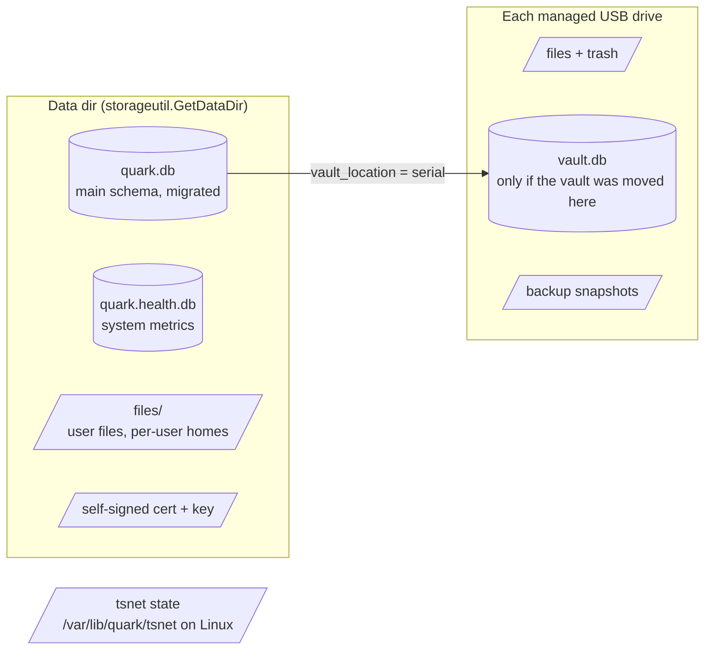
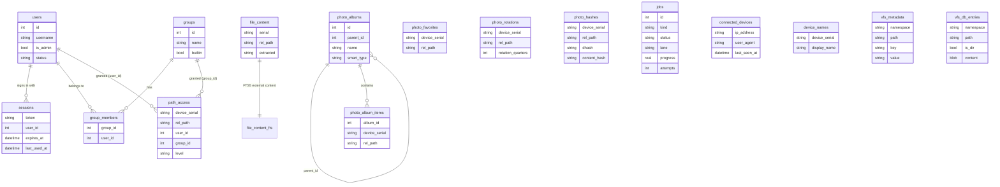
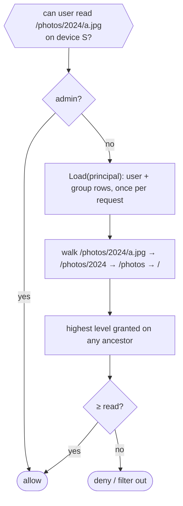
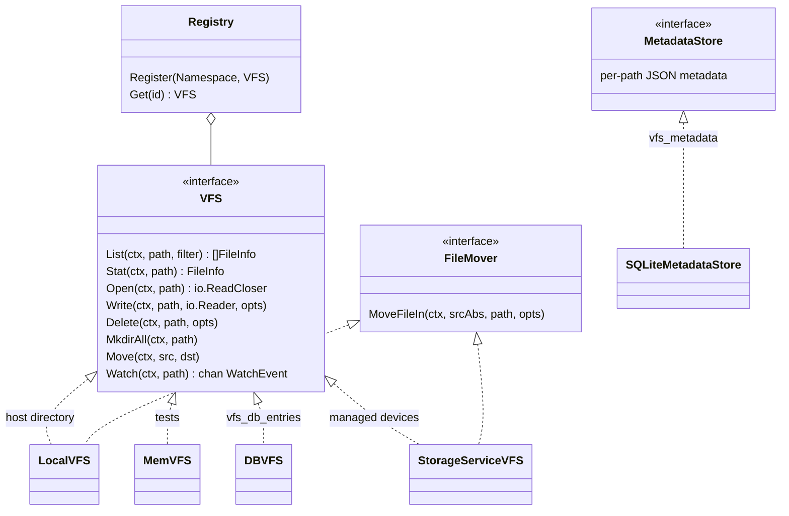

# Data

Files are the primary data and live on disk. SQLite holds only what cannot: identity, grants, collections, job
history, and indexes. The rule in `AGENTS.md` is to reach for the database last.

## Where state lives

| Store              | Opened by                         | Schema source                             |
| ------------------ | --------------------------------- | ----------------------------------------- |
| `quark.db`         | `db.ConnectToDatabase`            | `internal/db/migrations` (golang-migrate) |
| `quark.health.db`  | `db.ConnectToHealthDatabase`      | raw, owned by `healthutil`                |
| `vault.db`         | `db.ConnectToVaultDatabase`       | `internal/db/vault_schema.go`             |

All three use the pure-Go `modernc.org/sqlite` driver, so the binary cross-compiles without cgo.

## Main schema

Tables are grouped by the migration that introduced them. Queries live in `sql/queries/*.sql` and are generated
into `internal/db/*.sql.go` by sqlc, which type-checks them against the migrations.

Column lists are abbreviated to what explains a relationship; the migration files are authoritative. Files are
always addressed as `(device_serial, rel_path)`, never by a database id, so moving bytes on disk never needs a
join. `path_access.level` is `read`, `write` or `owner`, and each row names exactly one of a user or a group
(the built-in `everyone` group is seeded by the migration).

| Migration              | Tables                                                                  |
| ---------------------- | ----------------------------------------------------------------------- |
| `001_auth`             | `users`, `sessions`                                                     |
| `002_storage_devices`  | `device_names`, `device_roles`                                          |
| `003_connected_devices`| `connected_devices`                                                     |
| `004_photos`           | `photo_albums`, `photo_album_items`, `photo_rotations`, `photo_favorites`, `photo_hashes` |
| `005_vault`            | `vault_config`, `vault_folders`, `vault_entries`, `vault_location`      |
| `006_file_search`      | `file_content`, `file_content_fts` (FTS5)                               |
| `007_vfs`              | `vfs_metadata`, `vfs_db_entries`                                        |
| `008_unique_album_names` | constraint only                                                       |
| `009_jobs`             | `jobs`                                                                  |
| `010_path_access`      | `groups`, `group_members`, `path_access`                                |
| `011_user_status`      | column change on `users`                                                |

Migrations are numbered, gap-free and paired; `make check/migrations` fails a PR whose number is at or below
`main`'s highest, because golang-migrate would silently skip it on upgraded devices.

## Access control

`accessutil` answers "may this principal reach this path?". Grants are keyed by `(device serial, canonical
path)` and are additive down the tree: a path's level is the highest level granted on it or any ancestor.
Admins bypass the table, so a path with no grant is admin-only. Every account gets a home directory and an owner
grant on it; `repairHomes` restores that at startup for accounts that predate it.

## Virtual filesystem

`pkg/vfs` puts one interface over every place bytes can live. Handlers and services ask the registry for a
namespace; today the server registers one, `files`, backed by the storage service across all managed devices.

`Open` returns an `*os.File` for disk-backed namespaces, so callers needing random access (range requests, zip
listing, image decoding) type-assert to `io.ReaderAt` / `io.ReadSeeker` instead of buffering.

## The vault

The vault is an encrypted store for secrets. Its tables (`vault_config`, `vault_folders`, `vault_entries`) live
in `quark.db` by default; when the admin moves the vault to a USB drive, `vault_location` records that drive's
serial and the same tables are created in `vault.db` on the drive (`internal/db/vault_schema.go`). Unlocking
derives a key from the master password with Argon2id, checks it by decrypting a known verification value, and
holds the key in `vaultcrypto.VaultSession` memory only. Unplugging the drive locks the session. `pkg/backup`
exports the vault to another device and imports it back.
