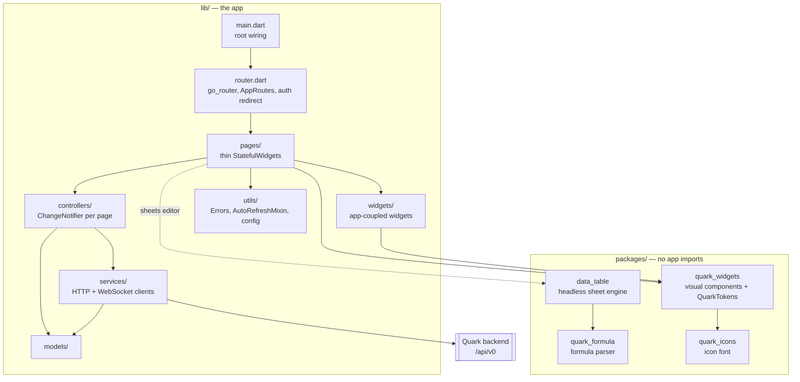
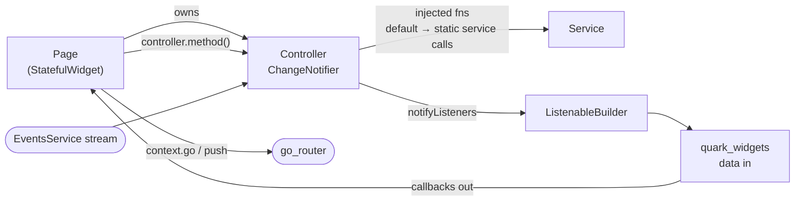
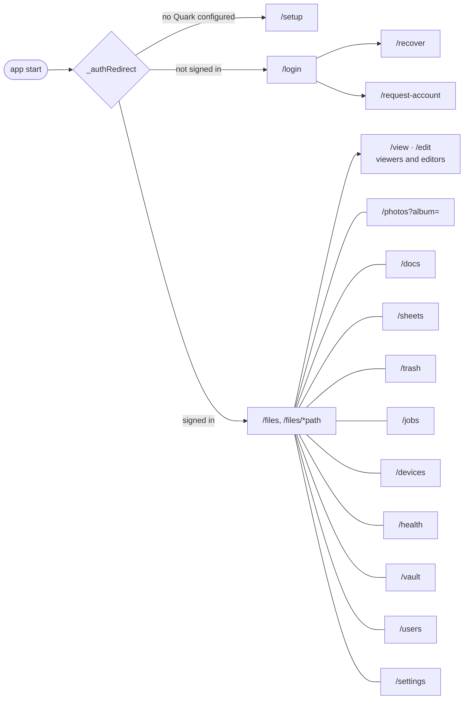

# Frontend

The client is one Flutter app (`lib/`) for web, iOS and Android, plus independent packages under `packages/` in a
single Dart pub workspace. The web build is compiled into `internal/server/public/` and embedded in the Go
binary, so the device serves its own UI.

## Layers

## Page anatomy

The target shape, which the decoupling work (#1600) is moving every page toward:

- Package widgets take immutable data and callbacks; they never fetch, navigate, or read global state.
- Controllers take their service calls as function parameters, so tests pass fakes without a mocking library.
- Pages with a refresh action use `AutoRefreshMixin` and `RefreshIconButton`.
- Every user-facing error string comes from `Errors` in `lib/utils/error_text.dart`.

Controllers exist today for files, photos, jobs, trash, users, and account requests; the remaining pages are
still coupled, and [`lib/widgets/README.md`](../../lib/widgets/README.md) tracks which.

## Services and the network

`AuthenticatedService` is the mixin every service uses: one shared `http.Client` (trusting the device's
self-signed certificate on native platforms), bearer auth from `AppSettings`, and a single `401` path back to
login. `EventsService` keeps one WebSocket to `/api/v0/events` and rebroadcasts `FileEvent`s to whoever listens.
Anything touching `dart:io` or the browser sits behind a conditional import (`foo_io.dart` / `foo_web.dart` /
`foo_stub.dart`) — `upload_chunk_source`, `ws_connect`, `local_media_proxy`.

## Routing

All routes are constants on `AppRoutes` in `lib/router.dart`, with `PathUrlStrategy` for clean URLs.

Top-level pages switch with `context.go` and share the drawer; drill-downs use `context.push`, which does not
update the address bar.

## Widget package

`packages/quark_widgets` is built to be published on its own. Each widget ships as a set: its file under
`lib/src/<group>/`, a barrel export, a test at 360x640 and 1280x800, and a `registry.dart` entry in the widget
gallery example. Colors, radii and spacing come from `QuarkTokens` through the theme. Tappable parts carry
deterministic `ValueKey`s so Flutter Probe scripts can drive them.
