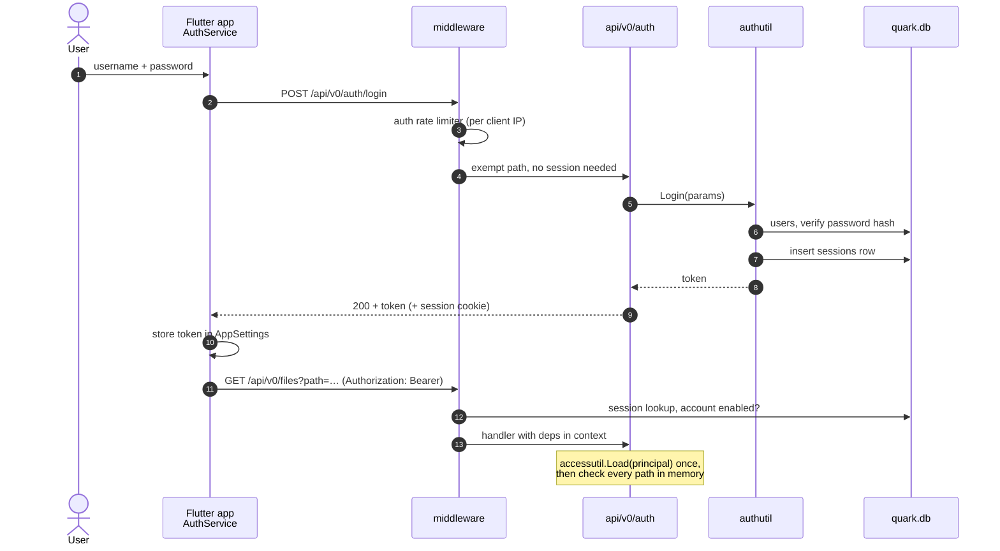
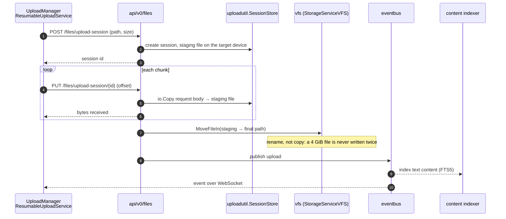
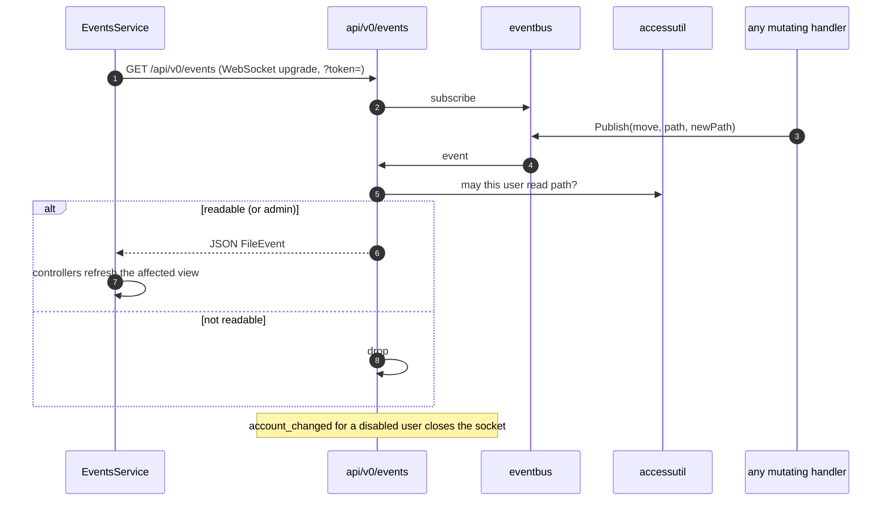
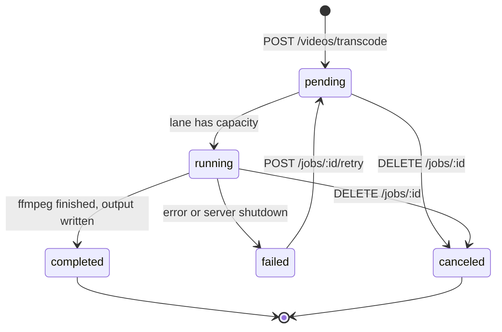
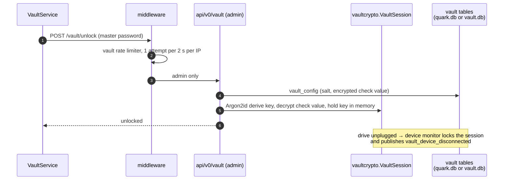

# Request flows

The paths below cover most of what the backend does at runtime. Each diagram names the package that owns each
step, so it doubles as a map for where to start reading.

## Sign-in and an authenticated request

## Streaming upload (resumable, chunked)

Large files use an upload session, so a dropped connection resumes instead of restarting and no chunk is ever
held whole in memory.

Small files take `POST /files/upload`, which streams the multipart body straight into `vfs.Write`. An abandoned
session is swept by the upload-session sweeper.

## Live events

## Background job (video transcode)

A job is a row in the `jobs` table, so history survives a restart. Every transition publishes a `job_*` event;
`GET /api/v0/jobs` remains the source of truth for the Jobs page.

## Vault unlock

