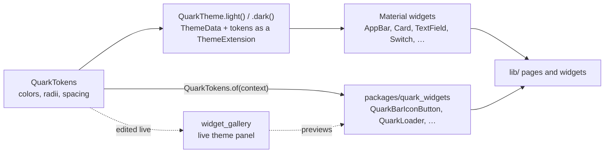

# Frontend styling

How the app stays visually consistent across ten-plus pages and two platforms: one token set, one theme
builder, and a handful of enforced components. This page describes the mechanism; the rules a change is held
to are in [`AGENTS.md`](../../AGENTS.md) and linked from each section below.



## The token set

[`QuarkTokens`](../../packages/quark_widgets/lib/src/theme/quark_tokens.dart) is the single source of truth for
every color, corner radius, and spacing value in the app: `background`, `card`, `sidebar`, `border`, `outline`, `input`,
three text colors, `primary`/`error`/`warning`/`success` accents, three radii (`radiusSm/Md/Lg`), and a
five-step spacing scale (`spacingXs` through `spacingXl`). `QuarkTokens.dark` and `QuarkTokens.light` are the
two sets Quark ships; dark is the default. Every field is `required`, so a new token cannot silently default
into a theme nobody has designed for.

Both sets meet WCAG 2.1 AA (#2600): every text color, `mutedForeground` and the accents included, holds 4.5:1
against every surface, and `outline` (the edge of an input, a checkbox, an off switch) holds 3:1. `border` is
for decorative hairlines only, which WCAG exempts. `packages/quark_widgets/test/theme/quark_theme_test.dart`
checks every pair, so a token edit that drops below AA fails the build.

`QuarkTokens.highContrastDark` and `QuarkTokens.highContrastLight` hold WCAG AAA's 7:1 for text, with 7:1
borders as well (#2601). `QuarkTheme.highContrastDark()` and `QuarkTheme.highContrastLight()` build them;
the app uses them when the Settings switch is on, and hands them to `MaterialApp` as `highContrastTheme` and
`highContrastDarkTheme` so the platform's own high-contrast setting picks them too.

A widget reaches the current set with `QuarkTokens.of(context)` rather than a hardcoded `Color` or literal
size. This is what lets the widget gallery's theme panel restyle the whole app live — a hardcoded value simply
does not move when the panel edits a token, which is the fastest way to spot one in review.

## From tokens to a theme

[`QuarkTheme`](../../packages/quark_widgets/lib/src/theme/quark_theme.dart) builds a Material `ThemeData` from
a `QuarkTokens` set: `QuarkTheme.light()` and `QuarkTheme.dark()`. It attaches the tokens themselves as a
`ThemeExtension`, so a widget can reach values Material's `ColorScheme` has no slot for (`sidebar`, `warning`,
`success`, the spacing scale) through the same `QuarkTokens.of(context)` call. Every Material component theme
Quark configures — `AppBarTheme`, `CardTheme`, `InputDecorationTheme`, button themes, `SwitchTheme`,
`CheckboxTheme`, dialogs, snack bars — is built entirely from `tokens`, never a literal, including the two-pixel
focus ring on inputs and buttons (`quark_theme.dart:89-96`, `:186-196`) that keyboard-only users depend on to
see where focus is.

## What's enforced, and where

The token system makes consistency possible; these rules, all in `AGENTS.md`, are what keep pages from
drifting back to bespoke Material widgets. This page does not restate them — read the section linked, since
that is what a reviewer holds the change to.

| Surface | Rule | Enforced by |
| --- | --- | --- |
| Colors, radii, spacing everywhere | Come from `QuarkTokens` through the theme, never a hardcoded value | [Widget package rules](../../AGENTS.md#widget-package-rules-packagesquark_widgets-always-follow-this) — visible in the gallery's theme panel |
| Every page's top bar | `QuarkBarIconButton` / `QuarkBarChip` / `QuarkBarSegmentedToggle`, `QuarkIcons` only, never a bare `IconButton`/`TextButton` or `Icons.` glyph | [Top bar actions](../../AGENTS.md#top-bar-actions-always-follow-this) — `test/widgets/app_bar_actions_style_test.dart` |
| Refresh actions | `AutoRefreshMixin` + `RefreshIconButton`, refresh lives in the app bar's dedicated slot, never `actions:` | [Refresh pattern](../../AGENTS.md#refresh-pattern-always-follow-this) — `test/widgets/app_bar_refresh_placement_test.dart` |
| Indeterminate loading | `QuarkLoader`, never `CircularProgressIndicator()` | [Flutter UI/layout principles](../../AGENTS.md#flutter-uilayout-principles) |
| User-facing error text | Only `Errors.message(...)` from `lib/utils/error_text.dart`, never an inline string or a thrown object | [Error text](../../AGENTS.md#error-text-always-follow-this) — `test/utils/error_text_test.dart` |
| Every widget's states, viewports, reduced motion | See the full contract | [Widget package rules](../../AGENTS.md#widget-package-rules-packagesquark_widgets-always-follow-this) — `packages/quark_widgets/test/gallery_registry_test.dart` |

## Changing the look

To change a color, radius, or spacing step app-wide: edit the value in `QuarkTokens.dark` / `QuarkTokens.light`
(`packages/quark_widgets/lib/src/theme/quark_tokens.dart`) and every widget built on the theme picks it up —
there is nothing else to regenerate. To add a new token: add the field to `QuarkTokens` (colors need `copyWith`,
`lerp`, `==`, and `hashCode` entries too — see the existing fields for the pattern), give both `dark` and
`light` a value, and reach it the same way everywhere else does, `QuarkTokens.of(context)`.

Preview any change without touching the app:

```sh
make -C packages/quark_widgets/examples/widget_gallery watch
```

The gallery renders every widget against the current theme, with a panel that edits each token live (a hex
field per color, a slider per radius and spacing step) and an event log that shows whether a widget's
callbacks actually fire. This is the fastest way to see a token change across every widget at once, and the
way reviewers spot a widget that quietly hardcoded a value instead of reading one.

## Read next

- [Frontend](frontend.md) — the app's layers, routing, and where `quark_widgets` sits in them
- [`packages/quark_widgets/README.md`](../../packages/quark_widgets/README.md) — the widget package's own rules
  and how to add a widget
- [`lib/widgets/README.md`](../../lib/widgets/README.md) — which app widgets are still service-coupled and
  waiting on the decoupling work, rather than presentational widgets that belong in the package
