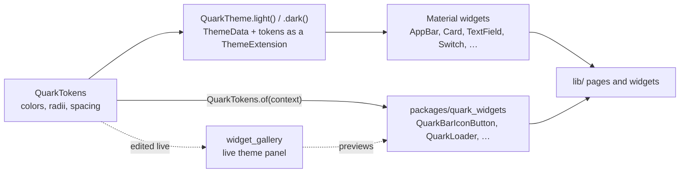

# Frontend styling

How the app stays visually consistent across ten-plus pages and two platforms: one token set, one theme
builder, and a handful of enforced components. This page describes the mechanism; the rules a change is held
to are in [`AGENTS.md`](../../AGENTS.md) and linked from each section below.



## The token set

[`QuarkTokens`](../../packages/quark_widgets/lib/src/theme/quark_tokens.dart) is the single source of truth for
every color, corner radius, and spacing value in the app: `background`, `card`, `sidebar`, `border`, `outline`,
`input`, three text colors, `primary`/`error`/`warning`/`success` accents, the `chrome` family for the app bar and the
drawer, three radii (`radiusSm/Md/Lg`), and a five-step spacing scale (`spacingXs` through `spacingXl`).
`QuarkTokens.dark` and `QuarkTokens.light` are the two sets Quark ships, and what the `classic` theme color
yields; dark is the default. Every field is `required`, so a new token cannot silently default into a theme
nobody has designed for.

`border` is a decorative hairline: dividers and the edges of cards, menus and dialogs, which WCAG 1.4.11
exempts. `outline` is the boundary of a control that has nothing else to show where it is — a text field, a
checkbox side, an off switch's track — and clears 3:1. Both classic sets are held to WCAG AA by
[`quark_tokens_contrast_test.dart`](../../packages/quark_widgets/test/theme/quark_tokens_contrast_test.dart)
(#2600): every text token, the status colors included, at 4.5:1 on every surface it is drawn on, text on a fill
at 4.5:1 on that fill, and `outline`, the focus ring and both switch states at 3:1.

A widget reaches the current set with `QuarkTokens.of(context)` rather than a hardcoded `Color` or literal
size. This is what lets the widget gallery's theme panel restyle the whole app live — a hardcoded value simply
does not move when the panel edits a token, which is the fastest way to spot one in review.

## From tokens to a theme

[`QuarkTheme`](../../packages/quark_widgets/lib/src/theme/quark_theme.dart) builds a Material `ThemeData` from
a `QuarkTokens` set: `QuarkTheme.light()` and `QuarkTheme.dark()`. It attaches the tokens themselves as a
`ThemeExtension`, so a widget can reach values Material's `ColorScheme` has no slot for (`sidebar`, `warning`,
`success`, the spacing scale) through the same `QuarkTokens.of(context)` call. Every Material component theme
Quark configures — `AppBarTheme`, `CardTheme`, `InputDecorationTheme`, button themes, `SwitchTheme`,
`CheckboxTheme`, dialogs, snack bars — is built entirely from `tokens`, never a literal, including the two-pixel
focus ring on inputs and buttons (`quark_theme.dart:120-127`, `:217-227`) that keyboard-only users depend on to
see where focus is.

The `ColorScheme` surface containers come from the tokens too, so a Material widget that paints with one stays
on theme (#2786): `surfaceContainerLowest` is `background`, `surfaceContainerLow` is `sidebar`,
`surfaceContainer` is `chrome` (Material's fill for a navigation bar, and the docs toolbar's),
`surfaceContainerHigh` is `card`, and `surfaceContainerHighest` is `card` under 8% of `foreground`, the well a
filled field or a header cell is drawn in.

## The theme color

One color is picked, per Quark by an admin and optionally per person, and the whole theme is derived from it
(#2740). A [`QuarkThemeColor`](../../packages/quark_widgets/lib/src/theme/quark_theme_color.dart) is a preset
name or a custom seed, and `tokensFor(brightness)` yields a full `QuarkTokens` set for light mode and another
for dark, so the light/dark/system toggle keeps working under any color. `QuarkTheme.light(themeColor:)` and
`QuarkTheme.dark(themeColor:)` build from those sets, and the argument is required: left optional it
defaulted to `classic`, which is how the docs page kept classic's palette under a picked color (#2786). It is
saved as `storageValue` (a preset name or `#rrggbb`) and read back with `QuarkThemeColor.parse`.

- **`classic` is Quark as it ships**: `QuarkTokens.light` and `QuarkTokens.dark`, untouched. Its accent is the
  blue preset's hue at the same strength, written out as constants. It is the default,
  the first preset, and what `parse` returns for null, empty, malformed, or unknown values.
- **Every other preset is a fixed seed** run through the same derivation as a custom one. Only the seed's hue
  is kept, and how colorful it is up to a cap: the theme's strength is the seed's saturation over one half, held
  to 0.45 at most (`_maxStrength`, #2777). A weak seed fades the theme toward gray (that is all `graphite` is, at
  about a third); the cap keeps a vivid seed from yielding chrome and an accent that tire the eye.
- **Colored chrome, tinted content.** The app bar and the drawer take `chrome`, a calm but colored tone of the
  hue. `background`, `card`, `input` and `sidebar` keep the classic lightness and carry a faint tint.
- **"Accent" means only the derived color**: `primary`, and `chromePrimary` where it is drawn on chrome. Nobody
  picks it.
- **Fixed whatever is picked**: `error`, `errorForeground`, `warning`, `success`, `eventColors`, the radii, the
  spacing scale, and avatar colors.

### Chrome has its own tokens

Chrome no longer shares a surface with content, so text on it cannot use the content's text colors.
`QuarkTokens` carries `chrome`, `chromeBorder`, `chromeForeground`, `chromeSecondaryForeground`,
`chromeMutedForeground` and `chromePrimary`; in the classic sets each equals its content counterpart
(`sidebar`, `border`, `foreground`, `secondaryForeground`, `mutedForeground`, `primary`), which is why classic
did not move.

A widget does not pick between the two families itself.
[`QuarkChrome`](../../packages/quark_widgets/lib/src/layout/quark_chrome.dart) marks a subtree as sitting on
chrome, and under it `QuarkTokens.of(context)` returns `tokens.onChrome`: the same set with `foreground`,
`cardForeground`, `secondaryForeground`, `mutedForeground`, `border` and `primary` swapped for their chrome
counterparts. So `QuarkBarIconButton` is one widget that draws correctly in a card and in the app bar.
`QuarkAppBar` and `QuarkDrawer` wrap themselves; a bar an app paints in `tokens.chrome` by hand wraps itself in
`QuarkChrome`. It is not a `Theme`, so a menu or dialog opened from the chrome is not under it and keeps
content colors. Surfaces are not swapped: a bar button keeps the `input` fill, and chrome text is derived to be
legible on it too.

### How each token is derived

In HSL, at the seed's hue. Each role starts from a saturation and lightness of its own, written `S / L` below
(every saturation is then multiplied by the theme's strength, 0.45 at most). Where a row says "until", the
lightness is moved in one direction, by bisection, only as far as it takes for the condition to hold on the
8-bit color that is painted. "Darker" and "lighter" are the direction of that move. Every "until" ratio is aimed
0.1 above the figure written, 4.6:1 for 4.5:1 and 3.1:1 for 3:1, because bisection stops the moment a ratio
holds and would otherwise leave pairs sitting exactly on the WCAG floor (#2785).

| Token | Light | Dark |
| --- | --- | --- |
| `background` | 0.45 / 0.968, lighter until luminance is 0.91 | 0.50 / 0.063 |
| `card`, `input` | 0.60 / 0.990, same floor | 0.45 / 0.112, and 0.42 / 0.127 |
| `sidebar` | 0.40 / 0.950, same floor | 0.45 / 0.086 |
| `border`, `outline` | 0.25 / 0.62, darker until 3:1 on every content surface | 0.25 / 0.40, lighter until the same |
| `foreground`, `cardForeground` | 0.45 / 0.11 | 0.30 / 0.91 |
| `secondaryForeground` | 0.22 / 0.34, darker until 6:1 on content | 0.20 / 0.65, lighter until the same |
| `mutedForeground` | 0.18 / 0.46, darker until 4.5:1 on content | 0.16 / 0.47, lighter until the same |
| `primary` | 0.85 / 0.45, darker until 4.5:1 on content and on its own 12% tint over it, and 3:1 on chrome | 0.85 / 0.60, lighter until the same |
| `primaryForeground` | white or `#0F172A`, whichever reads better on `primary` | same |
| `chrome` | 0.80 / 0.62, lighter until luminance is 0.45 | 0.70 / 0.10, lighter until luminance is 0.03 |
| `chromeBorder` | 0.50 / 0.40, darker until 3:1 on chrome | 0.40 / 0.50, lighter until the same |
| `chromeForeground` | 0.50 / 0.09 | 0.30 / 0.94 |
| `chromeSecondaryForeground` | 0.45 / 0.20, darker until 6:1 on chrome and on `input` | 0.30 / 0.80, lighter until the same |
| `chromeMutedForeground` | 0.40 / 0.30, darker until 4.5:1 on chrome and on `input` | 0.25 / 0.70, lighter until the same |
| `chromePrimary` | as `primary`, but until 4.5:1 on chrome and its tint too | same |

"Content" is `background`, `card`, `input` and `sidebar`. The light-mode floor of 0.91 is the luminance of the
classic sidebar: no tinted surface is darker than the darkest classic one, so the fixed status colors score no
worse on it. In light mode the chrome is a mid tone with dark text, because an accent dark enough to be
text on near-white content could not also stand out from a dark chrome. In dark mode the chrome is a deep tone
with light text.

### What the contrast test guarantees

[`quark_theme_color_test.dart`](../../packages/quark_widgets/test/theme/quark_theme_color_test.dart) holds every
derived preset and 483 custom seeds from around the wheel, in both modes, to all of this. Every pair the
derivation moves (text, muted text, the accent, borders) has to clear its ratio by the 0.1 margin; the fixed
status colors, `primaryForeground` and the seeded Material slots are held to the ratio itself:

| Pair | Ratio |
| --- | --- |
| `foreground`, `cardForeground`, `secondaryForeground`, `mutedForeground` on each content surface | 4.5:1 |
| `chromeForeground`, `chromeSecondaryForeground`, `chromeMutedForeground` on `chrome` and on a bar button's `input` fill | 4.5:1 |
| `primary` on each content surface, and on that surface under its own 12% tint (a selected chip) | 4.5:1 |
| `chromePrimary` on the same, and on `chrome` and its tint | 4.5:1 |
| `primaryForeground` on `primary` and on `chromePrimary` | 4.5:1 |
| `primary` on `chrome` | 3:1 |
| `border` and `outline` on each content surface, `chromeBorder` on `chrome` | 3:1 |
| `error`, `warning`, `success` on each content surface | 3:1, or what the color scores on the worst classic surface if that is lower |
| The Material slots `QuarkTheme.from` leaves seeded: `onSurfaceVariant` on each content surface and on the mapped `surfaceContainerHighest`, `onPrimaryContainer`, `onErrorContainer` on their containers | 4.5:1 |

The status colors are fixed rather than derived, and a derived surface can land a little lighter or darker than
classic's, so they are held to the boundary ratio there; on the classic sets they clear 4.5:1. `classic` is
written out rather than derived and is held to the ratios without the margin, in the full pair table of
`quark_tokens_contrast_test.dart` described above.

The same file holds the derivation to the design, so it cannot pass by going gray: the chrome and the accent
stay within three degrees of the seed's hue, the chrome's channels spread at least 0.12 in light mode and 0.07
in dark and at least twice the page's, content surfaces stay within 0.03 of the classic lightness, the light
and dark sets of one color share a hue, and preset hues keep 25 degrees from the status colors and from each
other.

### High contrast

High contrast is a variant of the theme color, not a replacement for it (#3071).
`tokensFor(brightness, highContrast: true)` starts from `QuarkTokens.highContrastDark` or
`QuarkTokens.highContrastLight` and recolors only the accent: `primary` and `chromePrimary` take the seed's hue at
up to 0.9 saturation and move away from the surfaces until they are 7:1, plus the 0.1 margin, on `background`,
`card`, `input`, `sidebar` and `chrome`, and `primaryForeground` is whichever of black and white reads better on
the result. Filled buttons, selection, links, switches and the focus ring are drawn in the accent, so that is
where the theme shows. Surfaces, text and outlines stay neutral, because a tint on any of them costs the contrast
the mode exists for. `classic` yields the shipped high-contrast pair untouched.
`QuarkTheme.highContrastLight(themeColor:)` and `QuarkTheme.highContrastDark(themeColor:)` build from those sets.
`quark_theme_color_test.dart` holds every preset and custom seed to the 7:1 ratios, and `quark_tokens_test.dart`
runs the full high-contrast table over every preset.

In the app, `AppSettings.themeColor` is the theme color in effect and `QuarkApp` in `lib/main.dart` rebuilds all
four themes from it: the everyday pair and the high-contrast pair, which the Settings switch and the platform's
contrast setting both select. It resolves two inputs: the Quark's default from `GET /settings/public` and the signed-in user's
own from `GET /settings/me`, which wins when it is not empty. `SettingsService.refreshThemeColor` fetches both
whenever the account is refreshed, the active host changes, or a `public_settings_changed` event arrives. The
resolved value is cached per host in `shared_preferences`, so the sign-in page wears the color last seen on that
Quark. Settings, General tab, is where a user picks their own and an admin picks the Quark's.

App widgets that sit in the app bar or the drawer read `QuarkTokens.of(context)`, never
`Theme.of(context).colorScheme` or a hardcoded color, neither of which `QuarkChrome` remaps. A drill-down page's
bar is a `ChromeAppBar` (`lib/widgets/layout/chrome_app_bar.dart`), a Material `AppBar` under `QuarkChrome`.
`test/widgets/chrome_legibility_test.dart` pumps the Files, Calendar and editor bars and the drawer under derived
themes and measures every text and icon against the fill behind it.

## What's enforced, and where

The token system makes consistency possible; these rules, all in `AGENTS.md`, are what keep pages from
drifting back to bespoke Material widgets. This page does not restate them — read the section linked, since
that is what a reviewer holds the change to.

| Surface | Rule | Enforced by |
| --- | --- | --- |
| Colors, radii, spacing everywhere | Come from `QuarkTokens` through the theme, never a hardcoded value | [Widget package rules](../../AGENTS.md#widget-package-rules-packagesquark_widgets-always-follow-this) — visible in the gallery's theme panel |
| Every page's top bar | `QuarkBarIconButton` / `QuarkBarChip` / `QuarkBarSegmentedToggle`, `QuarkIcons` only, never a bare `IconButton`/`TextButton` or `Icons.` glyph | [Top bar actions](../../AGENTS.md#top-bar-actions-always-follow-this) — `test/widgets/app_bar_actions_style_test.dart` |
| Refresh actions | `AutoRefreshMixin` + `RefreshIconButton`, refresh lives in the app bar's dedicated slot, never `actions:` | [Refresh pattern](../../AGENTS.md#refresh-pattern-always-follow-this) — `test/widgets/app_bar_refresh_placement_test.dart` |
| Indeterminate loading | `QuarkLoader`, never `CircularProgressIndicator()` | [Flutter UI/layout principles](../../AGENTS.md#flutter-uilayout-principles) |
| User-facing error text | Only `Errors.message(...)` from `lib/utils/error_text.dart`, never an inline string or a thrown object | [Error text](../../AGENTS.md#error-text-always-follow-this) — `test/utils/error_text_test.dart` |
| Every widget's states, viewports, reduced motion | See the full contract | [Widget package rules](../../AGENTS.md#widget-package-rules-packagesquark_widgets-always-follow-this) — `packages/quark_widgets/test/gallery_registry_test.dart` |

## Changing the look

To change a color, radius, or spacing step app-wide: edit the value in `QuarkTokens.dark` / `QuarkTokens.light`
(`packages/quark_widgets/lib/src/theme/quark_tokens.dart`) and every widget built on the theme picks it up —
there is nothing else to regenerate. To add a new token: add the field to `QuarkTokens` (colors need `copyWith`,
`lerp`, `==`, and `hashCode` entries too — see the existing fields for the pattern), give both `dark` and
`light` a value, and reach it the same way everywhere else does, `QuarkTokens.of(context)`.

Preview any change without touching the app:

```sh
make -C packages/quark_widgets/examples/widget_gallery watch
```

The gallery renders every widget against the current theme, with a panel that edits each token live (a hex
field per color, a slider per radius and spacing step) and an event log that shows whether a widget's
callbacks actually fire. This is the fastest way to see a token change across every widget at once, and the
way reviewers spot a widget that quietly hardcoded a value instead of reading one.

## Read next

- [Frontend](frontend.md) — the app's layers, routing, and where `quark_widgets` sits in them
- [`packages/quark_widgets/README.md`](../../packages/quark_widgets/README.md) — the widget package's own rules
  and how to add a widget
- [`lib/widgets/README.md`](../../lib/widgets/README.md) — which app widgets are still service-coupled and
  waiting on the decoupling work, rather than presentational widgets that belong in the package
