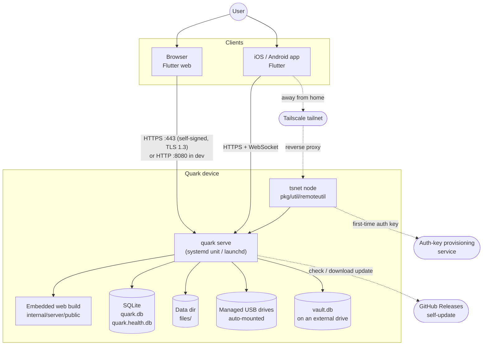

# System context

Quark runs as a single process on a device in the user's home — typically an ARM board running Linux (the
`armbian-build/` tree), or a Mac. There is no cloud component: clients talk straight to the device.

## Processes and entry points

`cmd/quark/main.go` is a cobra CLI with three commands:

| Command         | What it does                                                                        |
| --------------- | ----------------------------------------------------------------------------------- |
| `quark install` | writes the service unit (`internal/install`) and places the binary for the service user |
| `quark serve`   | builds `deputil.DefaultDependencies()` and calls `server.StartServer`                 |
| `quark version` | prints the build version                                                            |

`quark serve` binds `HTTPS_PORT` (default 443) with a self-signed certificate from `tlsutil`, or `PORT` (default
8080) in insecure dev mode. The same listener serves the API under `/api/v0`, Swagger under `/swagger`, and the
Flutter web build for every other path (an SPA fallback returns `index.html` so go_router can read the URL).

## Storage devices

Quark treats storage as a set of *managed devices*: the internal data directory plus any USB drive it has
adopted. `storageutil.StorageService` owns the list; a monitor goroutine polls every five seconds, auto-mounts
new drives, and publishes `vault_storage_changed`. Every file path a client sees is scoped to a device serial,
which is also the key of the access table.

## Remote access

Remote access is opt-in from Settings. When on, `remoteutil` starts an embedded Tailscale node (`tsnet`) that
reverse-proxies to the local listener, so the phone reaches the device over the tailnet without port forwarding.
The node's state persists; an auth key is provisioned only when there is none. Because the proxy connects from
loopback, `X-Forwarded-For` is trusted only from loopback (or `QUARK_TRUSTED_PROXIES`), which keeps the login
rate limiter keyed on the real client IP.
