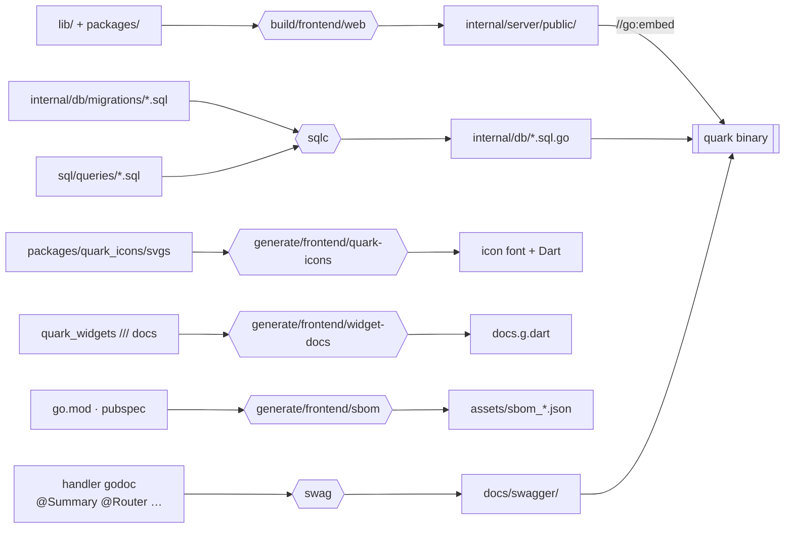
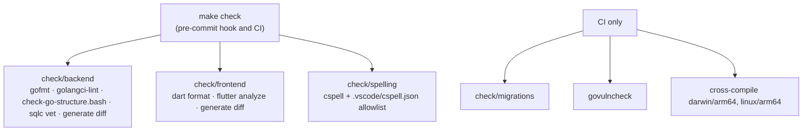
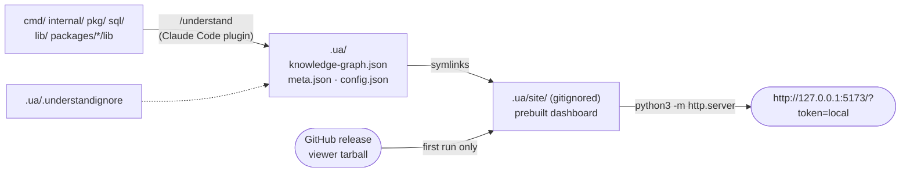

# Build and tooling

Everything runs through the Makefile (`make help` lists it). This page shows how the pieces feed each other; the
rules for using them are in [`AGENTS.md`](../../AGENTS.md).

## Code generation

Generated files are committed, and CI regenerates them and fails on any diff.



## Checks



## Running locally

| Target                      | Serves                                                   |
| --------------------------- | -------------------------------------------------------- |
| `make watch/backend`        | backend with hot reload (air), HTTP on `:8080`           |
| `make watch/backend/secure` | the same over HTTPS on `:443`, self-signed               |
| `make serve/frontend`       | Flutter web dev server pointed at the backend            |
| `make understand`           | the Understand-Anything knowledge graph dashboard         |

## Knowledge graph (`make understand`)

`.ua/` holds a knowledge graph of the codebase produced by the
[Understand-Anything](https://github.com/Egonex-AI/Understand-Anything) Claude Code plugin: every file,
function and dependency, grouped into layers, with summaries and a guided tour. It is committed so anyone can
browse it without running the analysis; Go, Flutter and cspell all skip it.



To view it:

```bash
make understand            # UA_PORT=8000 make understand to change the port
```

To regenerate it, install the plugin once and run the analysis from Claude Code in the repository root:

```text
/plugin marketplace add Egonex-AI/Understand-Anything
/plugin install understand-anything
/understand
```

Later runs are incremental — only files changed since the commit in `.ua/meta.json` are re-analyzed. The
scope is set by `.ua/.understandignore`, which excludes generated code, platform shells, tests and docs. The
static server cannot serve the source-code panel (the plugin's own `/understand-dashboard` can), but the graph,
search, layers and tours all work.
