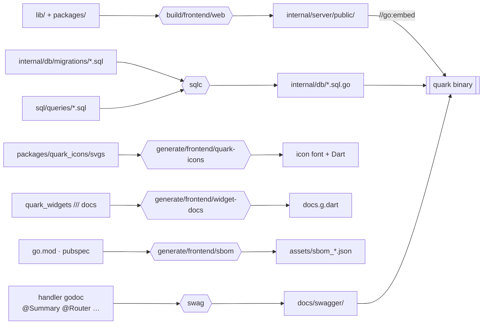
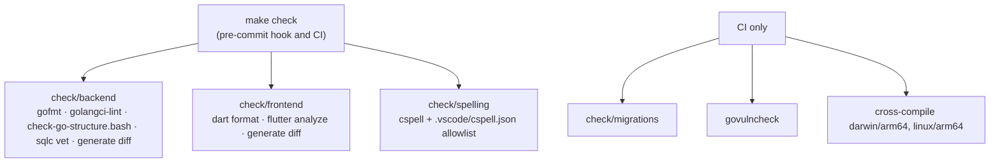
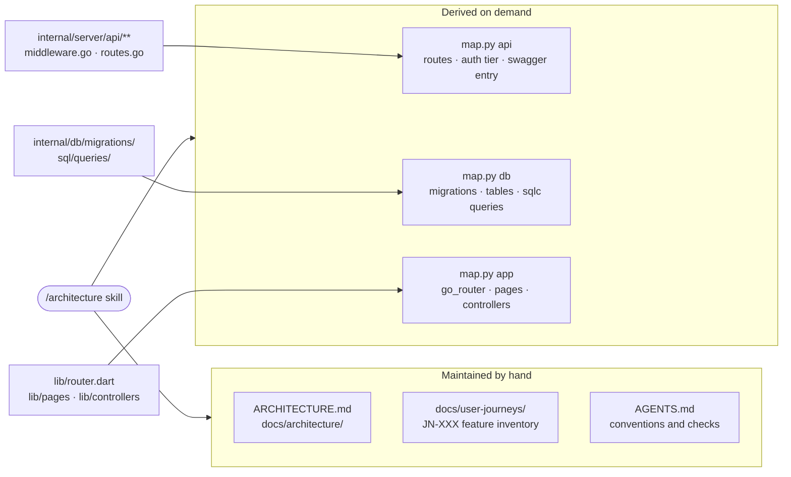

# Build and tooling

Everything runs through the Makefile (`make help` lists it). This page shows how the pieces feed each other; the
rules for using them are in [`AGENTS.md`](../../AGENTS.md).

## Code generation

Generated files are committed, and CI regenerates them and fails on any diff.



## Checks



## Running locally

| Target                      | Serves                                                   |
| --------------------------- | -------------------------------------------------------- |
| `make watch/backend`        | backend with hot reload (air), HTTP on `:8080`           |
| `make watch/backend/secure` | the same over HTTPS on `:443`, self-signed               |
| `make serve/frontend`       | Flutter web dev server pointed at the backend            |

## Knowledge base

There is no generated graph to keep in sync. The knowledge base is these pages plus the
`architecture` skill in [`.claude/skills/architecture/`](../../.claude/skills/architecture/SKILL.md),
which tells an agent which source answers which question and ships a script that derives the
rest from the tree on demand.



Because the script reads the tree rather than a cache, it is right on a dirty working tree
and on any branch:

```bash
python3 .claude/skills/architecture/scripts/map.py api
python3 .claude/skills/architecture/scripts/map.py db
python3 .claude/skills/architecture/scripts/map.py app
```

`map.py api --audit` is the one that catches drift. It exits non-zero when a live route has
no swagger operation, when swagger carries an operation no router serves, when a handler
package is never mounted, or when a route is declared in a shape the script cannot read.

Swag only reads an annotation block that sits directly above a named `func`. A handler
written as an inline closure inside `var xRoute = serverutil.ApiRoute(...)` is skipped
silently, annotations and all — which is why `--audit` compares against the router rather
than trusting `docs/swagger/` to be complete.
